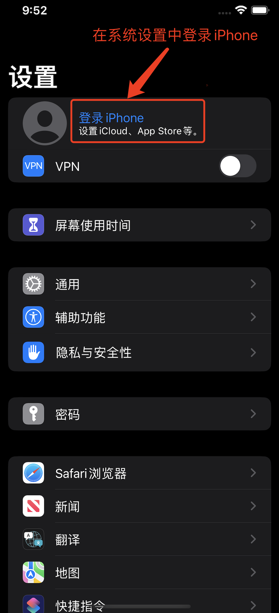
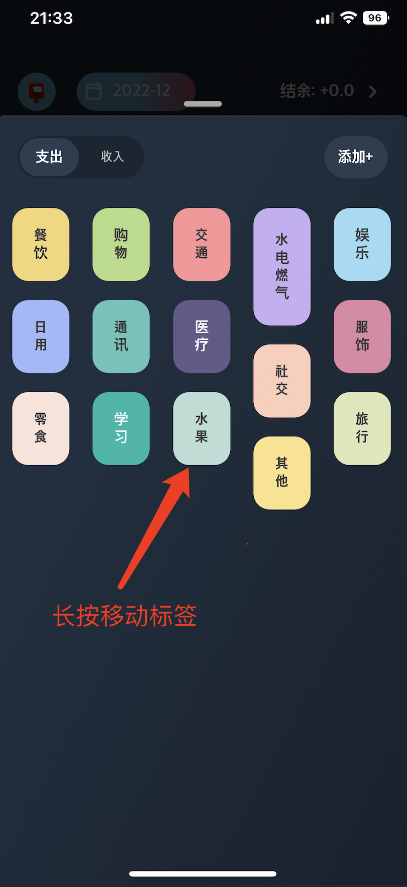
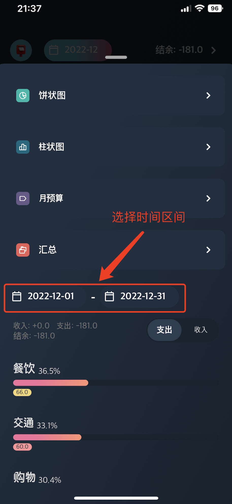

# 记录Box常见问题

## 1. 为什么不用登录？记账数据会丢失吗？
 - 记录Box的数据存在`手机本地`或您的[iCloud云盘](https://support.apple.com/zh-cn/guide/icloud/mm74e822f6de/icloud)中。
 - 在iPhone设置中登录AppleID，并开通记录Box的iCloud订阅服务，数据会自动同步到您的iCloud，更换手机也不怕数据丢失了!
 
 

 

---

## 2. 如何切换记账类别顺序？
 - 在`类别`页面`长按`可以移动标签位置
 
 

 

---

## 3. 可以自定义时间段查看记账数据吗？
- `分析`页点击时间按钮，选择时间区间过滤记账
 
 

 