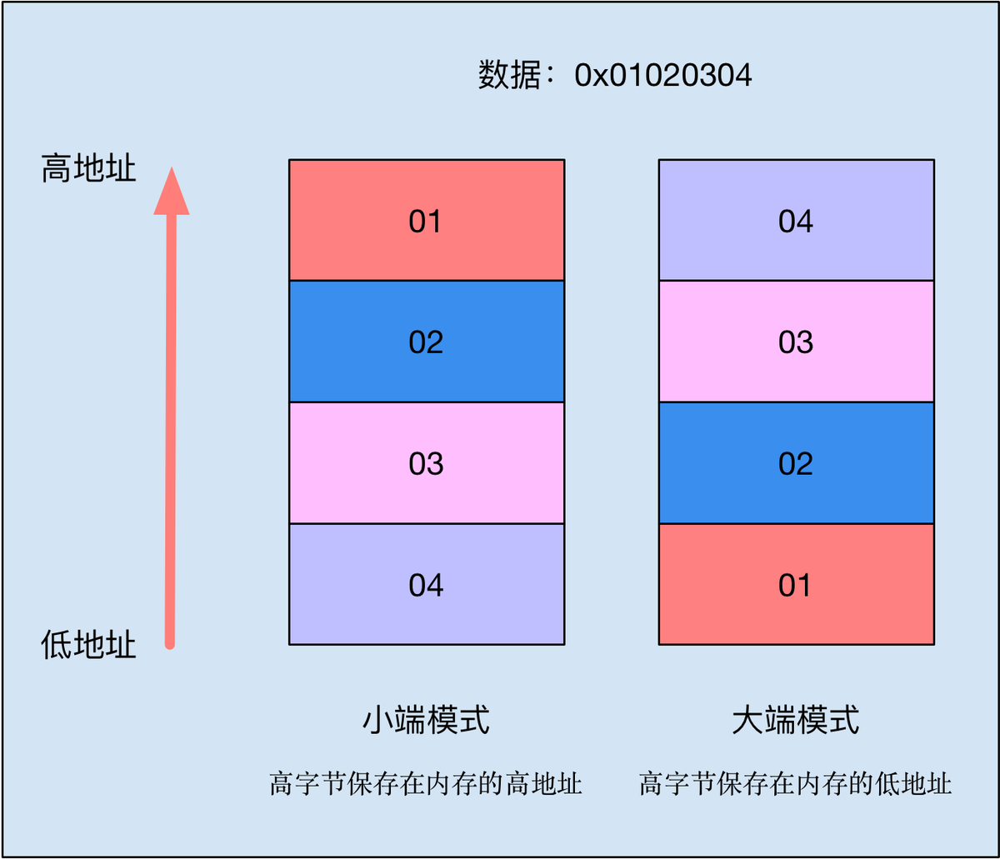

# iOS蓝牙开发数据处理

在蓝牙项目的开发过程中，会遇到了一些与数据处理有关的问题
> 1. 数据大小端的介绍
> 2. 大小端数据模式的转换
> 3. 按位运算，左移、右移运算

## 一、数据大小端的介绍

> - 大小端表示数据在计算机中的存放顺序。
> - 大端模式符合人类的正常思维，高字节保存在内存的低地址。
> - 小端模式方便计算机处理，高字节保存在内存的高地址。
> - iOS中默认的是小端存储。



你可以在Xcode中运行下面这两行代码，就会打印出大小端模式。
```Objective-C
short int number = 0x8866;
NSLog(@"%@",[NSString stringWithFormat:@"%x",((char *)&number)[0]].intValue == 66 ? @"小端模式" : @"大端模式");
```

## 二、大小端数据模式的转换

蓝牙通信的时候，从硬件接收到的数据是NSData类型，我们需要对数据进行解析才能拿到真正方便使用的数据。
但是接收到的数据在内存中的保存顺序可能与我们希望的相反，所以在解析的过程中就涉及到了大小端的转换问题。

其实iOS的大小端转换非常方便，在苹果的Core Fundation中就提供了进行这些数据处理的方法。[Apple官方文档](https://developer.apple.com/documentation/corefoundation/byte_order_utilities?language=objc)

下面我就举几个例子，一起来看一下Fundation中与大小端有关方法的基本使用。

1、CFByteOrderGetCurrent()
返回当前电脑的大小端模式
```Objective-C
CFByteOrderGetCurrent()
返回的值是一个如下的枚举
enum __CFByteOrder {
    CFByteOrderUnknown,       // 未知的
    CFByteOrderLittleEndian,  // 小端模式
    CFByteOrderBigEndian      // 大端模式
};
```

2、CFSwapInt16()
转换一个16位的整型数字
```Objective-C
// 把数字15转换模式
CFSwapInt16(15)

// 上面运算得到的结果十进制为3840，十六进制为0xF00。
// 而0xF00反转过来就是0xF = 15，所以证明这个方法确实对15进行了反转。
```

3、CFSwapInt16BigToHost()
把一个16位的整型数字从大端模式转为本机数据存放模式。如果本机为大端模式，则原值不变。
```Objective-C
// 把大端模式的数字Number转为本机数据存放模式
CFSwapInt16BigToHost(Number)
```

4、CFSwapInt32HostToBig()
把一个32位本机模式数据转换为大端模式。如果本机为大端模式，则原值不变。
```Objective-C
// 把本地存储模式的数字Number转为大端模式
CFSwapInt32HostToBig(Number)
```

还有好多方法（详见官方文档），基本都是大同小异，从字面就可以理解它的用法。

通常能用到的也就那么两三个。
一般需求是把大端转成本地模式，也就是小端模式。
```Objective-C
CFSwapInt16BigToHost
CFSwapInt32BigToHost
```

下面是封装好了的两个方法，在开发中可以直接用来解析数据。两个方法分别返回Signed和Unsigned类型的数据。代码中的location代表准备解析的数据的位置，offset代表需要解析几位。

> 需要注意的是，当仅仅是解析1位数据的时候，就不需要使用像CFSwapInt16BigToHost这样的方法了，具体可以查阅代码。

```Objective-C
// 转为本地大小端模式 返回Signed类型的数据
+(signed int)signedDataTointWithData:(NSData *)data Location:(NSInteger)location Offset:(NSInteger)offset {
    signed int value=0;
    NSData *intdata= [data subdataWithRange:NSMakeRange(location, offset)];
    if (offset==2) {
        value=CFSwapInt16BigToHost(*(int*)([intdata bytes]));
    }
    else if (offset==4) {
        value = CFSwapInt32BigToHost(*(int*)([intdata bytes]));
    }
    else if (offset==1) {
        signed char *bs = (signed char *)[[data subdataWithRange:NSMakeRange(location, 1) ] bytes];
        value = *bs;
    }
    return value;
}
```

```Objective-C
// 转为本地大小端模式 返回Unsigned类型的数据
+(unsigned int)unsignedDataTointWithData:(NSData *)data Location:(NSInteger)location Offset:(NSInteger)offset {
    unsigned int value=0;
    NSData *intdata= [data subdataWithRange:NSMakeRange(location, offset)];
    
    if (offset==2) {
        value=CFSwapInt16BigToHost(*(int*)([intdata bytes]));
    }
    else if (offset==4) {
        value = CFSwapInt32BigToHost(*(int*)([intdata bytes]));
    }
    else if (offset==1) {
        unsigned char *bs = (unsigned char *)[[data subdataWithRange:NSMakeRange(location, 1) ] bytes];
        value = *bs;
    }
    return value;
}
```

## 三、按位运算，左移、右移运算
在讲解位运算和左右移之前，先来回忆回忆基本的数据计量单位。
> 1字节是一个8位的数据，可以代表从0-255共256个数字。
1B（byte，字节）= 8 bit（位）。

模拟一次解析数据的过程：
> 1. 假如蓝牙每次发过来的数据大小为32个字节，这个数据在NSData类型下Log出来是这个样子：<0aa60000 00000000 00000000 00000000 00000000 00000059 9db56800 00260b01>
> 2. 每两个数字表示一个十六进制的数据，例如最左边的0a代表了一个字节，也就是0x0A = 10。
> 3. 现在我们要截取最左边的0aa6这两个字节（16位），这个数据是UInt16类型，那么首先要做的就是运用上面封装好了的大小端转换方法来截取这两个字节，下面代码中的result就是所需要的数据。
```Objective-C
// 从第0位开始，截取2个字节，所以location是0，offset是2
UInt16 result = [self unsignedDataTointWithData:data Location:0 Offset:2];
```

可是拿到result之后工作还没有结束。

需求：result的二进制是0000 1010 1010 0110，一个16位的数字，假如与硬件工程师提前说好了，低4位（0110）代表组数，5-8位（1010）代表每组的人数。
如何分别拿出所需的数据呢？

这时候，位运算就派上用场了。一起来看看位运算和左右移的基本使用方法和情景，需求的答案也在其中。

#### 1、按位与 &

同为1为1，否则为0

例如：3 & 5
0000 0011
0000 0101
0000 0001 = 1    
所以 3 & 5=1

> 特点：
> - （1）清零：任何数和0相与，结果为0.
> - （2）取出指定位的值。取哪一位，就把对应的位定为1。

> 例如：
> 拿到了一个16位的数据result = 0000 1010 1010 0110，如何拿到这个数据的低4位呢？
> 就可以使用按位与，代码如下
```Objective-C
// 0x000f == 0000 0000 0000 1111
// 按位与上result之后，得到的number == 0000 0000 0000 0110 就是低4位的数据0110
int number = result & 0x000f;
```

#### 2、按位或 |

只要有一个为1就为1
负数按补码的形式参加按位或运算

例如：3 | 5
0000 0011
0000 0101
0000 0111 = 7    
所以 3 | 5=7

> 特点：
> - （1）对数据的某些位置1。

> 例如：
> 将X=1010 0000的后四位置1
> 1010 0000
> 0000 1111
> 1010  1111    
> 这样后4位就全为1了

#### 3、异或运算 ^

如果对应的位不同则为1，相同为0

> 例如 3 ^ 5
> 0000 0011
> 0000 0101
> 0000 0110    
> 所以 3 ^ 5= 6

> 特点：
> - （1）特定位翻转，哪一位需要翻转就把对应的位设置为1
> - （2）任何数和0异或，原值不变。
> - （3）异或运算可以交换位置：3 ^ 5 ^ 6 == 3 ^ 6 ^ 5
> - （4）相同的数异或等于0：9 ^ 9 == 0  
> - （5）a ^ b ^ a == b

#### 4、取反 ~

0变1，1变0

> 例如 ~3
> 0000 0011
> 1111 1100

> 特点：
> - （1）配合按位与把一个数的最低位设置为0

> 例如：
> 把 X=1011 0111按位与（~1）
> X & (~1) = 1011 0110
> 这样最后一位就为0了

#### 5、左移运算  <<

二进制位全部左移若干位，左边的丢弃，右边补0

> 例如  3<<2
> 0000 0011 = 3
> 0000 1100 = 12 (左移后)
> 左移3<<2 == 12

> 特点：
> - 若左移时舍弃的最高位不包含1，则每左移一位，就乘以一次2.
> - 所以a<<n 就是 a乘以2的n次方

#### 6、右移运算 >>

二进制右移若干位，正数左边补0，负数左边补1，右边丢弃。

> 例如 12>>2
> 0000 1100 = 12
> 0000 0011 = 2 (右移后)
> 右移12>>2 == 3

> 特点：
> - 每右移一位，就除以一次2.
> - a>>n 就是 a除以2的n次方

> 例如：
> 继续用上面按位与的例子，
> 拿到了一个16位的数据result = 0000 1010 1010 0110，如何拿到这个数据的5-8位呢？
> 首先运用按位与把5-8位之外的数据全部置0，然后用右移来拿到具体数值。
> 代码如下
```Objective-C
// 0x00f0 == 0000 0000 1111 0000，result按位与0xf0之后，结果为0000 0000 1010 0000
// 然后右移4位，得到最终所需要的数据number == 0000 0000 0000 1010
int number = (result & 0x00f0) >> 4;
```

