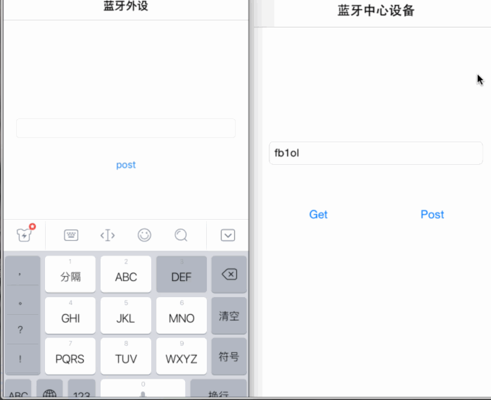
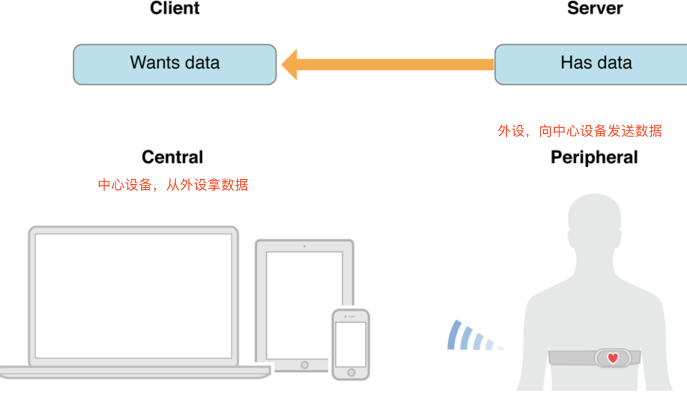
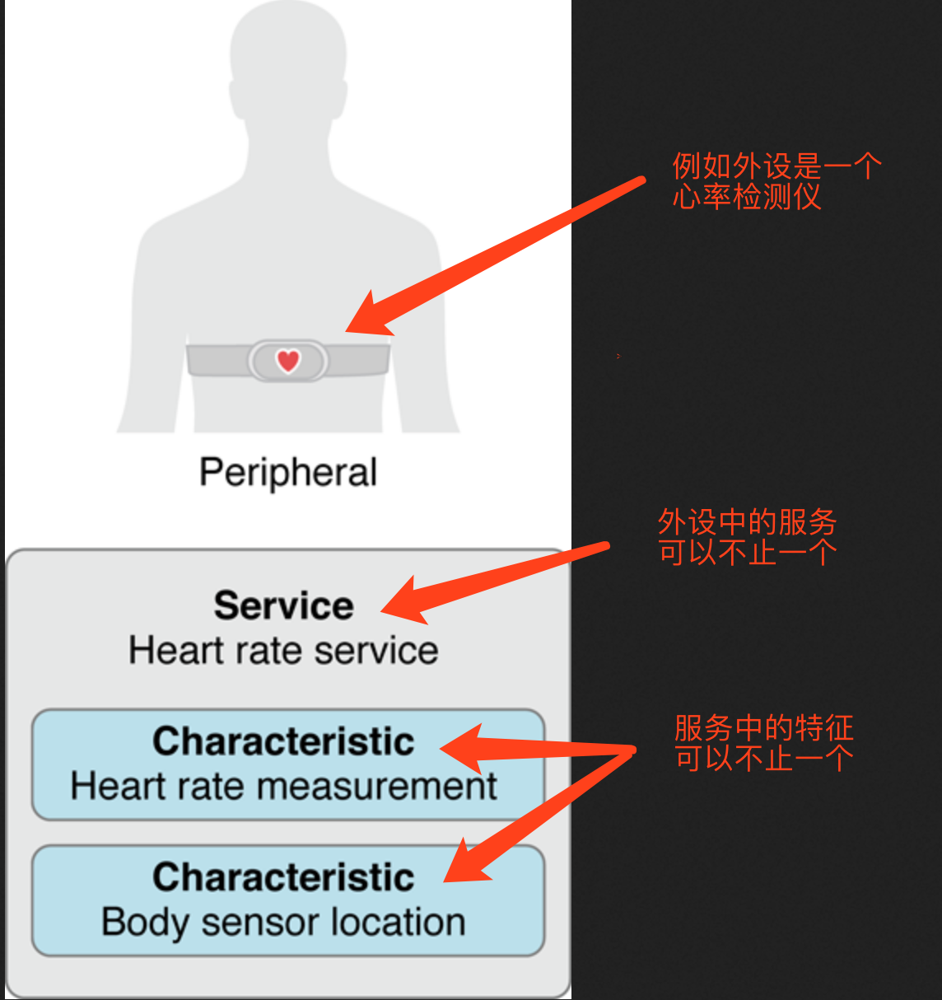
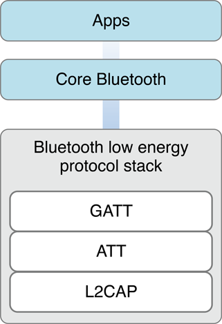
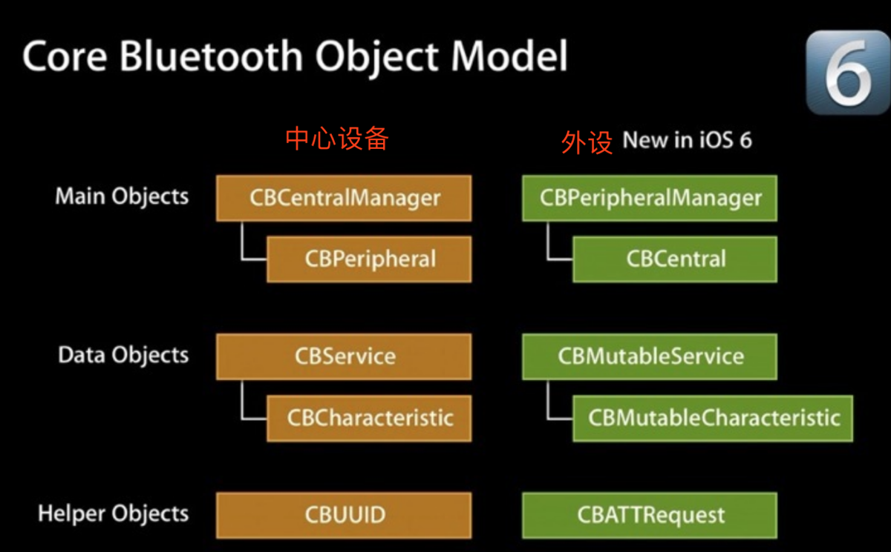
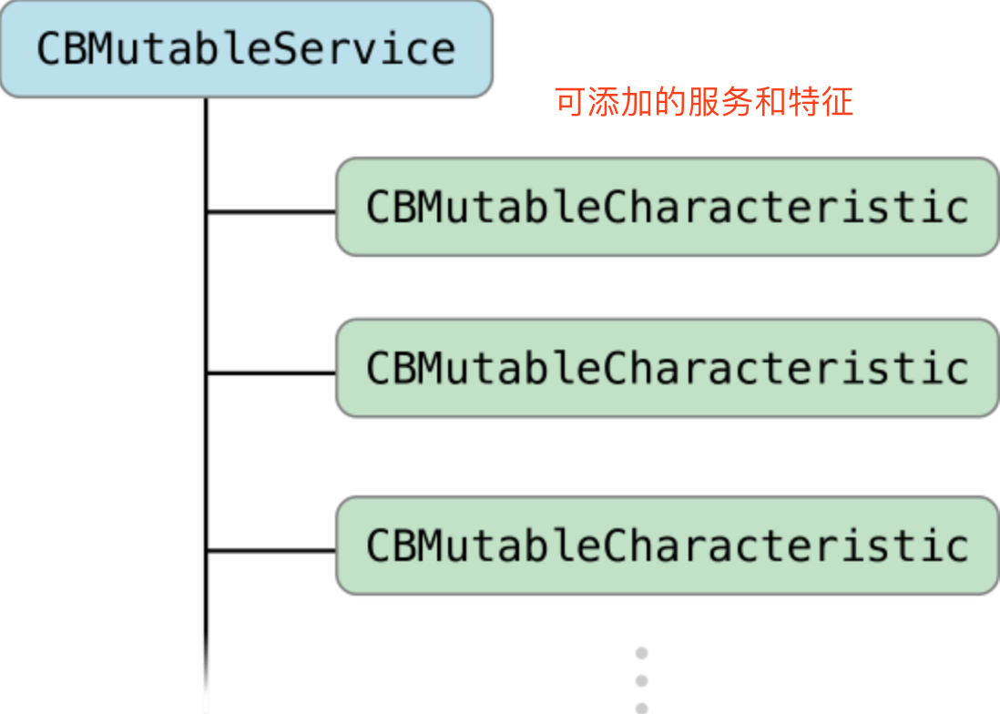
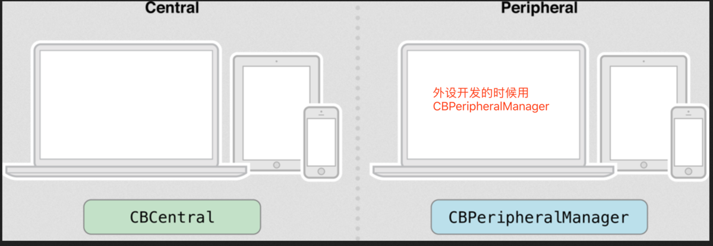
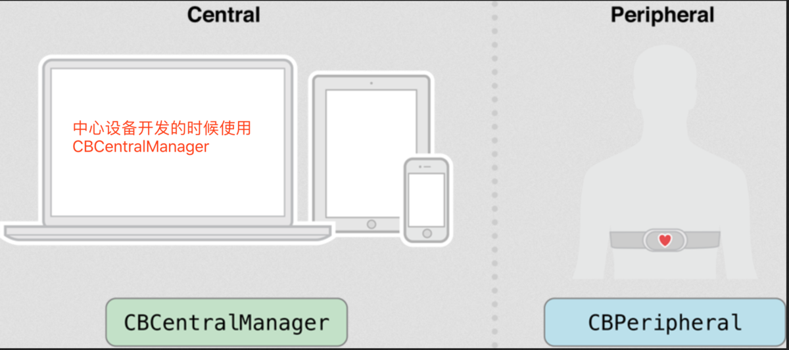

# iOS蓝牙开发

> - 1、iOS蓝牙开发的关键词
> - 2、蓝牙的简单介绍
> - 3、CoreBluetooth框架
> - 4、实现iOS蓝牙外设（**[Demo](https://github.com/remember17/WHBLEDemo)**）
> - 5、实现iOS蓝牙中心设备（**[Demo](https://github.com/remember17/WHBLEDemo)**）

Demo的运行gif图如下，中心设备可以从外设读取数据，也可以向外设写入数据。外设也可以向中心设备发送数据。
PS：需要使用真机测试。



iOS的蓝牙开发是围绕着CoreBluetooth框架来实现的。
下面先从iOS蓝牙开发的基本概念说起。

## 一、iOS蓝牙开发的关键词

> 中心设备：就是用来扫描周围蓝牙硬件的设备，比如通过你手机的蓝牙来扫描并连接智能手环，这时候你的手机就是中心设备。

> 外设：被扫描的设备。比如当你用手机的蓝牙扫描连接智能手环的时候，智能手环就是外设。



> 广播：就是外设不停的散播蓝牙信号，让中心设备可以扫描到。


> 服务（services）：外设广播和运行的时候会有服务，可以理解成一个功能模块，中心设备可以读取服务。外设可以有多个服务。

> 特征（characteristic）：在服务中的一个单位，一个服务可以有多个特征，特征会有一个value，一般读写的数据就是这个value。




> UUID：区分不同的服务和特征，可以理解为服务和特征的身份证。我们可以用UUID来挑选需要的服务和特征。

## 二、蓝牙的简单介绍
[蓝牙](https://zh.wikipedia.org/wiki/藍牙)是一种短距离无线通信技术 ，可实现固定设备、移动设备和楼宇个人域网之间的短距离数据交换（使用2.4—2.485GHz的ISM波段的UHF无线电波）。蓝牙4.2发布于2014年12月2日。

## 三、CoreBluetooth框架



如上图所示，iOS中的蓝牙开发框架CoreBluetooth处在蓝牙低功耗协议栈的上面，我们开发的时候只是使用CoreBluetooth这个框架，通过CoreBluetooth可以轻松实现外设或中心设备的开发。

CoreBluetooth可以分为两大模块，中心设备central，外设peripheral，它们俩各有自己的一套API供我们使用。



上图左边的就是中心设备的开发类，我们平时是使用CBCentralManager来进行相关操作。
> * CBCentralManager： 蓝牙中心设备管理类，用来统一调度中心设备的开发
```Objective-C
* CBPeripheral ：蓝牙外设，例如蓝牙手环、心率监测仪。
* CBService ：蓝牙外设的服务，可以有0个或者多个服务。
* CBCharacteristic ：服务中的特征，每一个蓝牙服务中可以有0个或多个特征，特征中包含数据信息。
* CBUUID：可以理解为服务或特征的身份证，可以用来选择需要的服务和特征。
```

右边是外设开发相关类，一般是围绕着CBPeripheralManager来进行编码。
> * CBPeripheralManager： 蓝牙外设开发时使用，用来开发蓝牙外设的中心管理类。
```Objective-C
* CBCentral：蓝牙中心设备，例如用来连接蓝牙手环的手机。
* CBMutableService：外设开发的时候可以添加多个服务，所有这里用CBMutableService来创建添加服务。
* CBMutableCharacteristic：每个服务中可以有多个特征，外设开发给服务添加特征的时候使用这个类。
* CBATTRequest：读或者写请求。它的实例对象有一个value属性，用来装载外设进行蓝牙读取或写入请求时的数据。一般在外设写入或读取的回调方法中有这一个参数。
```




## 四、实现iOS蓝牙外设（**[Demo](https://github.com/remember17/WHBLEDemo)**）



1、首先导入CoreBluetooth框架，并遵守协议

```Objective-C
#import <CoreBluetooth/CoreBluetooth.h>
// 遵守CBPeripheralManagerDelegate协议
@interface ViewController () <CBPeripheralManagerDelegate>
```

2、创建外设管理对象，用一个属性来强引用这个对象。并且在创建的时候设置代理，声明放到哪个线程。

```Objective-C
@property (nonatomic, strong) CBPeripheralManager *peripheralManager;

// 创建外设管理器，会回调peripheralManagerDidUpdateState方法
self.peripheralManager = [[CBPeripheralManager alloc] initWithDelegate:self queue:dispatch_get_main_queue()];
```

3、当创建CBPeripheralManager的时候，会回调判断蓝牙状态的方法。当蓝牙状态没问题的时候创建外设的Service（服务）和Characteristics（特征）。

```Objective-C
/*
 设备的蓝牙状态
 CBManagerStateUnknown = 0,  未知
 CBManagerStateResetting,    重置中
 CBManagerStateUnsupported,  不支持
 CBManagerStateUnauthorized, 未验证
 CBManagerStatePoweredOff,   未启动
 CBManagerStatePoweredOn,    可用
 */
- (void)peripheralManagerDidUpdateState:(CBPeripheralManager *)peripheral {
    if (peripheral.state == CBManagerStatePoweredOn) {
        // 创建Service（服务）和Characteristics（特征）
        [self setupServiceAndCharacteristics];
        // 根据服务的UUID开始广播
        [self.peripheralManager startAdvertising:@{CBAdvertisementDataServiceUUIDsKey:@[[CBUUID UUIDWithString:SERVICE_UUID]]}];
    }
}
```
可以先用宏来做两个标识字符串，用来创建服务和特征的UUID。
最终把创建好的特征放进服务，把服务放入中心管理器。

```Objective-C
#define SERVICE_UUID @"CDD1"
#define CHARACTERISTIC_UUID @"CDD2"

/** 创建服务和特征 */
- (void)setupServiceAndCharacteristics {
    // 创建服务
    CBUUID *serviceID = [CBUUID UUIDWithString:SERVICE_UUID];
    CBMutableService *service = [[CBMutableService alloc] initWithType:serviceID primary:YES];
    // 创建服务中的特征
    CBUUID *characteristicID = [CBUUID UUIDWithString:CHARACTERISTIC_UUID];
    CBMutableCharacteristic *characteristic = [
                                               [CBMutableCharacteristic alloc]
                                               initWithType:characteristicID
                                               properties:
                                               CBCharacteristicPropertyRead |
                                               CBCharacteristicPropertyWrite |
                                               CBCharacteristicPropertyNotify
                                               value:nil
                                               permissions:CBAttributePermissionsReadable |
                                               CBAttributePermissionsWriteable
                                               ];
    // 特征添加进服务
    service.characteristics = @[characteristic];
    // 服务加入管理
    [self.peripheralManager addService:service];
    
    // 为了手动给中心设备发送数据
    self.characteristic = characteristic;
}
```
注意CBCharacteristicPropertyNotify这个参数，只有设置了这个参数，在中心设备中才能订阅这个特征。
一般开发中可以设置两个特征，一个用来发送数据，一个用来接收中心设备写过来的数据，我们这里为了方便就只设置了一个特征。
最后用一个属性拿到这个特征，是为了后面单独发送数据的时候使用，数据的写入和读取最终还是要通过特征来完成。

4、当中心设备读取这个外设的数据的时候会回调这个方法。

```Objective-C
/** 中心设备读取数据的时候回调 */
- (void)peripheralManager:(CBPeripheralManager *)peripheral didReceiveReadRequest:(CBATTRequest *)request {
    // 请求中的数据，这里把文本框中的数据发给中心设备
    request.value = [self.textField.text dataUsingEncoding:NSUTF8StringEncoding];
    // 成功响应请求
    [peripheral respondToRequest:request withResult:CBATTErrorSuccess];
}
```

5、当中心设备写入数据的时候，外设会调用下面这个方法。

```Objective-C
/** 中心设备写入数据的时候回调 */
- (void)peripheralManager:(CBPeripheralManager *)peripheral didReceiveWriteRequests:(NSArray<CBATTRequest *> *)requests {
    // 写入数据的请求
    CBATTRequest *request = requests.lastObject;
    // 把写入的数据显示在文本框中
    self.textField.text = [[NSString alloc] initWithData:request.value encoding:NSUTF8StringEncoding];
}
```

6、还有一个主动给中心设备发送数据的方法。

```Objective-C
/** 通过固定的特征发送数据到中心设备 */
- (IBAction)didClickPost:(id)sender {
    BOOL sendSuccess = [self.peripheralManager updateValue:[self.textField.text dataUsingEncoding:NSUTF8StringEncoding] forCharacteristic:self.characteristic onSubscribedCentrals:nil];
    if (sendSuccess) {
        NSLog(@"数据发送成功");
    }else {
        NSLog(@"数据发送失败");
    }
}
```

7、中心设备订阅成功的时候回调。

```Objective-C
/** 订阅成功回调 */
-(void)peripheralManager:(CBPeripheralManager *)peripheral central:(CBCentral *)central didSubscribeToCharacteristic:(CBCharacteristic *)characteristic {
    NSLog(@"%s",__FUNCTION__);
}
```

8、中心设备取消订阅的时候回调。

```Objective-C
/** 取消订阅回调 */
-(void)peripheralManager:(CBPeripheralManager *)peripheral central:(CBCentral *)central didUnsubscribeFromCharacteristic:(CBCharacteristic *)characteristic {
    NSLog(@"%s",__FUNCTION__);
}
```

以上就是iOS蓝牙外设的基本实现流程，当然还有更多的地方可以进一步处理，这就需要投入更多的时间来学习实验了。

下面进入iOS蓝牙开发的主要部分，中心设备的实现，这也是手机App通常担任的角色。

## 五、实现iOS蓝牙中心设备（**[Demo](https://github.com/remember17/WHBLEDemo)**）



1、同外设开发一样，首先要导入CoreBluetooth框架。

```Objective-C
#import <CoreBluetooth/CoreBluetooth.h>
```

2、遵守的协议与外设开发不同，中心设备的开发需要遵循如下两个协议。

```Objective-C
@interface ViewController () <CBCentralManagerDelegate,CBPeripheralDelegate>
```

3、创建中心管理器并用属性强引用，创建的时候也会设置代理和选择线程。

```Objective-C
@property (nonatomic, strong) CBCentralManager *centralManager;

// 创建中心设备管理器，会回调centralManagerDidUpdateState
self.centralManager = [[CBCentralManager alloc] initWithDelegate:self queue:dispatch_get_main_queue()];
```

4、当创建中心管理对象的时候，会回调如下方法用来判断中心设备的蓝牙状态。当蓝牙状态没问题的时候，可以根据外设服务的UUID来扫描需要的外设。所以自然而然的就想到了要定义与外设UUID相同的宏。

```Objective-C
/** 判断手机蓝牙状态 */
#define SERVICE_UUID        @"CDD1"
#define CHARACTERISTIC_UUID @"CDD2"

- (void)centralManagerDidUpdateState:(CBCentralManager *)central {
    // 蓝牙可用，开始扫描外设
    if (central.state == CBManagerStatePoweredOn) {
        NSLog(@"蓝牙可用");
        // 根据SERVICE_UUID来扫描外设，如果不设置SERVICE_UUID，则扫描所有蓝牙设备
        [central scanForPeripheralsWithServices:@[[CBUUID UUIDWithString:SERVICE_UUID]] options:nil];
    }
    if(central.state==CBCentralManagerStateUnsupported) {
        NSLog(@"该设备不支持蓝牙");
    }
    if (central.state==CBCentralManagerStatePoweredOff) {
        NSLog(@"蓝牙已关闭");
    }
}
```

5、当扫描到外设之后，就会回调下面这个方法，可以在这个方法中继续设置筛选条件，例如根据外设名字的前缀来选择，如果符合条件就进行连接。

```Objective-C
/** 发现符合要求的外设，回调 */
- (void)centralManager:(CBCentralManager *)central didDiscoverPeripheral:(CBPeripheral *)peripheral advertisementData:(NSDictionary<NSString *, id> *)advertisementData RSSI:(NSNumber *)RSSI {
    // 对外设对象进行强引用
    self.peripheral = peripheral;
    
//    if ([peripheral.name hasPrefix:@"WH"]) {
//        // 可以根据外设名字来过滤外设
//        [central connectPeripheral:peripheral options:nil];
//    }
    
    // 连接外设
    [central connectPeripheral:peripheral options:nil];
}
```

6、当连接成功的时候，就会来到下面这个方法。为了省电，当连接上外设之后，就让中心设备停止扫描，并且别忘记设置连接上的外设的代理。在这个方法里根据UUID进行服务的查找。

```Objective-C
/** 连接成功 */
- (void)centralManager:(CBCentralManager *)central didConnectPeripheral:(CBPeripheral *)peripheral{
    // 可以停止扫描
    [self.centralManager stopScan];
    // 设置代理
    peripheral.delegate = self;
    // 根据UUID来寻找服务
    [peripheral discoverServices:@[[CBUUID UUIDWithString:SERVICE_UUID]]];
    NSLog(@"连接成功");
}
```

7、连接失败和断开连接也有各自的回调方法。在断开连接的时候，我们可以设置自动重连，根据项目需求来自定义里面的代码。

```Objective-C
/** 连接失败的回调 */
-(void)centralManager:(CBCentralManager *)central didFailToConnectPeripheral:(CBPeripheral *)peripheral error:(NSError *)error {
    NSLog(@"连接失败");
}

/** 断开连接 */
- (void)centralManager:(CBCentralManager *)central didDisconnectPeripheral:(CBPeripheral *)peripheral error:(nullable NSError *)error {
    NSLog(@"断开连接");
    // 断开连接可以设置重新连接
    [central connectPeripheral:peripheral options:nil];
}
```

8、下面开始处理代理方法。

最开始就是发现服务的方法。这个方法里可以遍历服务，找到需要的服务。由于上面做的外设只有一个服务，所以我这里直接取服务中的最后一个lastObject就行了。
找到服务之后，连贯的动作继续根据特征的UUID寻找服务中的特征。

```Objective-C
/** 发现服务 */
- (void)peripheral:(CBPeripheral *)peripheral didDiscoverServices:(NSError *)error {
    
    // 遍历出外设中所有的服务
    for (CBService *service in peripheral.services) {
        NSLog(@"所有的服务：%@",service);
    }
    
    // 这里仅有一个服务，所以直接获取
    CBService *service = peripheral.services.lastObject;
    // 根据UUID寻找服务中的特征
    [peripheral discoverCharacteristics:@[[CBUUID UUIDWithString:CHARACTERISTIC_UUID]] forService:service];
}
```

9、下面这个方法里做的事情不少。

当发现特征之后，与服务一样可以遍历特征，根据外设开发人员给的文档找出不同特征，做出相应的操作。
我的外设只设置了一个特征，所以也是直接通过lastObject拿到特征。
再重复一遍，一般开发中可以设置两个特征，一个用来发送数据，一个用来接收中心设备写过来的数据。
这里用一个属性引用特征，是为了后面通过这个特征向外设写入数据或发送指令。
readValueForCharacteristic方法是直接读一次这个特征上的数据。

```Objective-C
/** 发现特征回调 */
- (void)peripheral:(CBPeripheral *)peripheral didDiscoverCharacteristicsForService:(CBService *)service error:(NSError *)error {
    
    // 遍历出所需要的特征
    for (CBCharacteristic *characteristic in service.characteristics) {
        NSLog(@"所有特征：%@", characteristic);
        // 从外设开发人员那里拿到不同特征的UUID，不同特征做不同事情，比如有读取数据的特征，也有写入数据的特征
    }
    
    // 这里只获取一个特征，写入数据的时候需要用到这个特征
    self.characteristic = service.characteristics.lastObject;
    
    // 直接读取这个特征数据，会调用didUpdateValueForCharacteristic
    [peripheral readValueForCharacteristic:self.characteristic];
    
    // 订阅通知
    [peripheral setNotifyValue:YES forCharacteristic:self.characteristic];
}
```

setNotifyValue:(BOOL)enabled forCharacteristic:(CBCharacteristic *)characteristic方法是对这个特征进行订阅，订阅成功之后，就可以监控外设中这个特征值得变化了。

10、当订阅的状态发生改变的时候，下面的方法就派上用场了。

```Objective-C
/** 订阅状态的改变 */
-(void)peripheral:(CBPeripheral *)peripheral didUpdateNotificationStateForCharacteristic:(CBCharacteristic *)characteristic error:(NSError *)error {
    if (error) {
        NSLog(@"订阅失败");
        NSLog(@"%@",error);
    }
    if (characteristic.isNotifying) {
        NSLog(@"订阅成功");
    } else {
        NSLog(@"取消订阅");
    }
}
```

11、外设可以发送数据给中心设备，中心设备也可以从外设读取数据，当发生这些事情的时候，就会回调这个方法。通过特种中的value属性拿到原始数据，然后根据需求解析数据。

```Objective-C
/** 接收到数据回调 */
- (void)peripheral:(CBPeripheral *)peripheral didUpdateValueForCharacteristic:(CBCharacteristic *)characteristic error:(NSError *)error {
    // 拿到外设发送过来的数据
    NSData *data = characteristic.value;
    self.textField.text = [[NSString alloc] initWithData:data encoding:NSUTF8StringEncoding];
}
```

12、中心设备可以向外设写入数据，也可以向外设发送请求或指令，当需要进行这些操作的时候该怎么办呢。

* 首先把要写入的数据转化为NSData格式，然后根据上面拿到的写入数据的特征，运用方法writeValue:(NSData *)data forCharacteristic:(CBCharacteristic *)characteristic type:(CBCharacteristicWriteType)type来进行数据的写入。

* 当写入数据的时候，系统也会回调这个方法peripheral:(CBPeripheral *)peripheral didWriteValueForCharacteristic:(nonnull CBCharacteristic *)characteristic error:(nullable NSError *)error 。

```Objective-C
/** 写入数据 */
- (IBAction)didClickPost:(id)sender {
    // 用NSData类型来写入
    NSData *data = [self.textField.text dataUsingEncoding:NSUTF8StringEncoding];
    // 根据上面的特征self.characteristic来写入数据
    [self.peripheral writeValue:data forCharacteristic:self.characteristic type:CBCharacteristicWriteWithResponse];
}


/** 写入数据回调 */
- (void)peripheral:(CBPeripheral *)peripheral didWriteValueForCharacteristic:(nonnull CBCharacteristic *)characteristic error:(nullable NSError *)error {
    NSLog(@"写入成功");
}
```

13、中心设备如何主动从外设读取数据呢。
* 用正在连接的外设对象来调用readValueForCharacteristic方法，并且把将要读取数据的特征作为参数，这样就可以主动拿一次数据了。
去到第12步的回调方法中，在特征的value属性中拿到这次的数据。

```Objective-C
/** 读取数据 */
- (IBAction)didClickGet:(id)sender {
    [self.peripheral readValueForCharacteristic:self.characteristic];
}
```

中心设备的开发是需要配合外设来进行的，一般会有硬件工程师或嵌入式工程师给出通信协议，根据协议来对项目的各种需求进行操作。

**[Demo](https://github.com/remember17/WHBLEDemo)**

