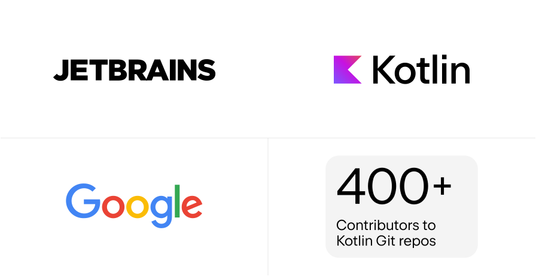
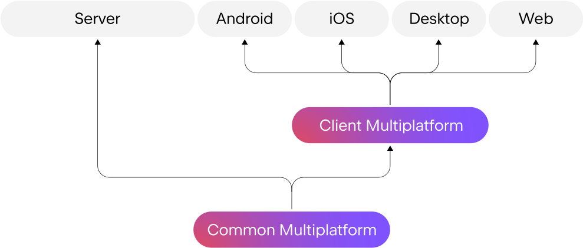
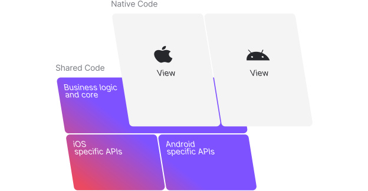
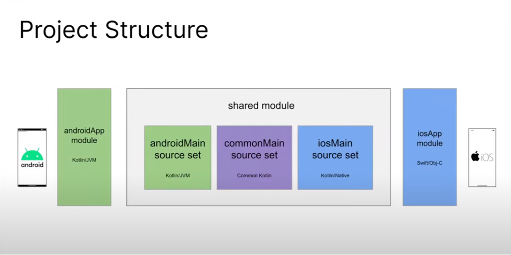
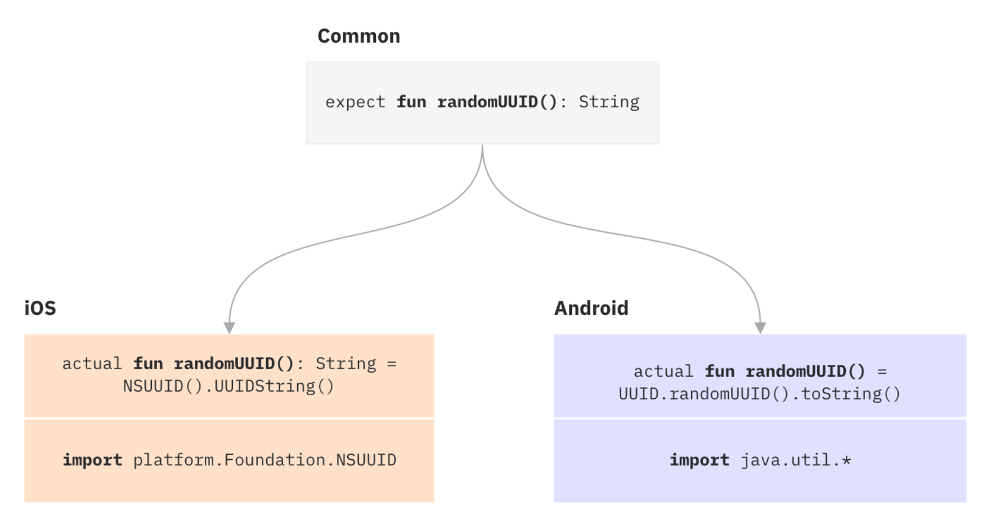
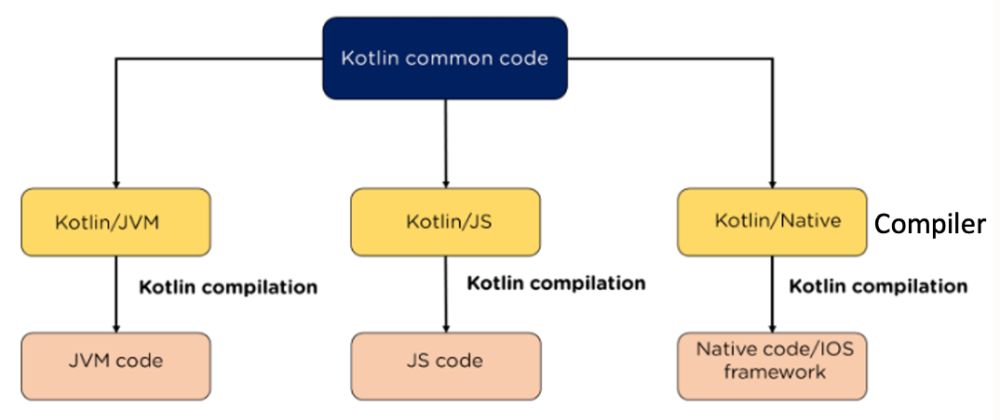
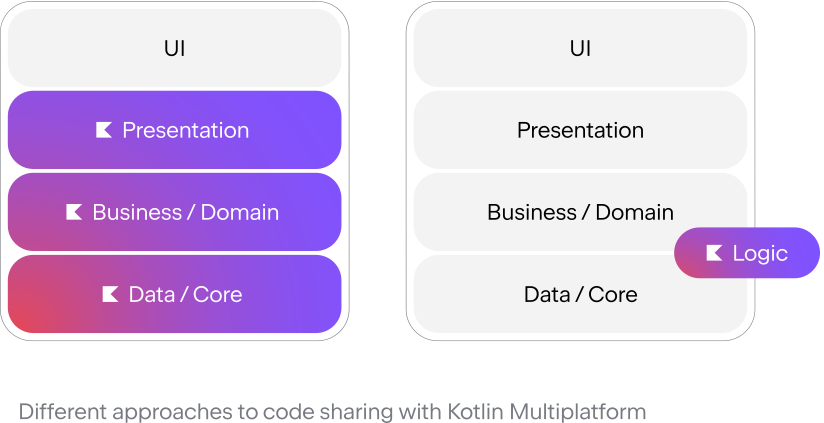
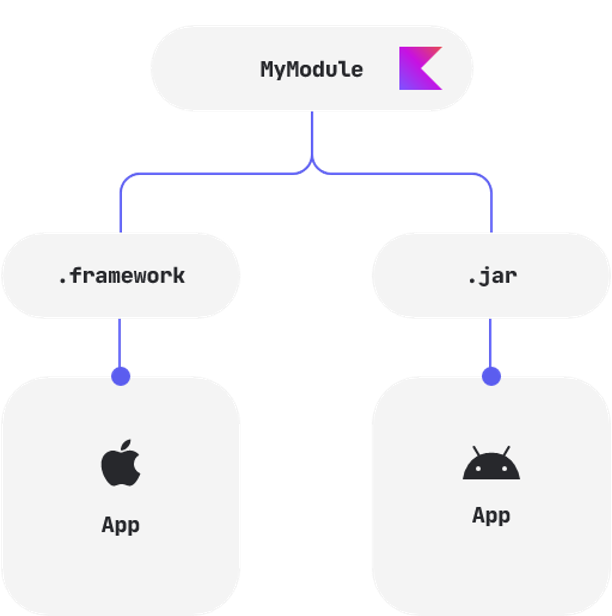
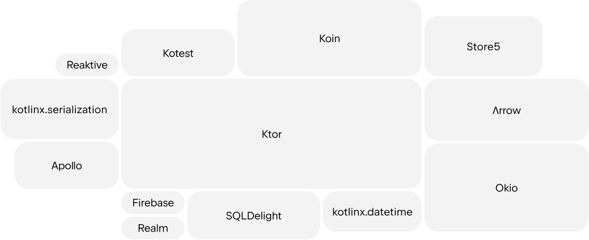

# KMM初探

## Kotlin是什么？

`Kotlin`是一种由`JetBrains`创造的类型强安全的编程语言，主要设计运行在Java虚拟机`（JVM）`上。

`Google`已经宣布`Kotlin`作为`Android`开发的首选语言。

`Kotlin`是开源的，拥有超过400名活跃的贡献者。

简单来说，`Kotlin`是一种广受欢迎的编程语言。

 

## Kotlin Multiplatform是什么？

`Kotlin Multiplatform`允许`Kotlin`代码在多平台上运行，包括`JVM`、`Android`、`iOS`、`macOS`、`Windows`、`Linux`和`Web`等。

虽然`Kotlin Multiplatform`仍处于`Beta`阶段，但它已经成为`Kotlin`团队的重点项目，预期将在今年（2023）发布稳定版本。

 

## 缩写释义：KMP 和 KMM

KMM：`Kotlin Multiplatform Mobile`

KMP：`Kotlin Multiplatform Project`

当我们只谈论移动设备开发时，则是KMM。只有iOS和Android。

如果我们说的是所有平台，包括Web、服务端等，那就是KMP。

 

## 什么样的项目适合使用KMM？

跨平台功能相似的项目最适合使用KMM。

典型的例子就是`iOS`和`Android`项目，它们的业务逻辑、网络、数据库和日志记录等都可以进行代码复用。这些公共部分非常适合进行代码共享。

更棒的是，KMM允许iOS和Android各自实现其`Native UI`。

 

## KMM项目结构

我们用`Android Studio`创建一个KMM项目，生成的`Gradle`项目包含三个模块：`shared`、`androidApp`和`iosApp`。

对于后端开发，可以使用IntelliJ来创建KMP项目。

首先看图片中间的`shared`模块，它包含三个部分：`commonMain`用于存放通用的Kotlin代码，`androidMain`和`iosMain`分别用于存放Android和iOS专用代码。所有在`shared`模块中的代码都可以在iOS和Android上使用。

右侧的`iosApp`模块是一个iOS Xcode项目，可以打包并上传到App Store，并且会集成`shared`模块的代码。

最左侧的部分则是一个Android项目，其工作方式与iosApp模块相同。

 

## 连接到特定平台的API

虽然KMM允许我们编写大量的共享代码，但有时候，我们仍需要访问特定平台的API。
KMM提供了`Expect`和`Actual`两个关键字，用于实现这一目标。左图展示了这两个关键字的声明。

让我们一起看看右图中的例子。假设我们需要实现一个`randomUUID()`方法，但iOS和Android有各自不同的UUID获取API。

iOS需要导入`Foundation`并使用`NSUUID().UUIDString()`，而Android则需要导入`java.util`并使用`UUID.randomUUID().toString()`。在这种情况下，我们可以使用`Expect`和`Actual`。

首先，在图的顶部，我们使用`Expect`来声明一个`randomUUID()`函数，接着在`iosMain`和`androidMain`中使用`Actual`来实现该方法。

这样，我们就可以在任何地方使用这个方法，而无需关心每个平台的具体实现方式，因为KMM会自动找到相应平台的具体实现。

`Expect`和`Actual`关键字可适用于函数、类、接口、枚举、属性等。

 

## Kotlin Multiplatform是如何工作的?

关键是`Kotlin为不同平台提供了特定的编译器`, 可以根据目标平台转换代码。

这些编译器包括`Kotlin/JVM`、`Kotlin/JavaScript`和`Kotlin/Native`。编译器会将Kotlin代码转换成相应平台的可执行代码,从而使普通的Kotlin代码能够在不同平台上运行。

这个过程实际上比较复杂,涉及`LLVM`、中间产物、前端编译器、后端编译器等。但现在我们只需要知道,KMP的工作原理是依赖不同的编译器就可以了。

 

## 在新项目或已有项目中使用

我们可以自由选择在项目中应用Kotlin Multiplatform的范围。

可以启动一个全新的项目,将数据层和业务层全部使用KMM来编写。

也可以仅选择某个逻辑使其跨平台,将其作为微库连接到现有项目中。

重点是,使用KMM非常灵活,你可以将其理解为仅是一个集成到主项目中的共享SDK,由你决定SDK的内容。

 

## 原生性能

KMP直接将共享代码编译成各平台的可执行代码,因此性能与原生一致。

 

## 良好的社区支持

许多知名库已经支持`Kotlin Multiplatform`, 如`Ktor`、`SQLDelight`、`Arrow`和`Realm`等。

而且正如之前提到的, `JetBrains`和`Google`也在大力支持它。

