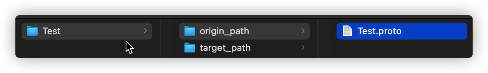
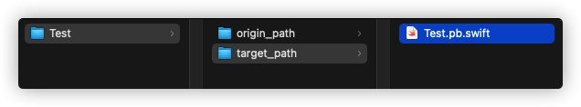
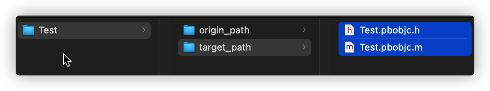

# iOS ProtocolBuffer环境配置与使用

Protocol Buffer是Google出品的一种轻量高效的结构化数据存储格式

---

## 1️⃣ Swift

## 一、环境配置

可以直接终端：
```
brew install swift-protobuf
```

也可以按如下步骤配置：
### 1.Clone Protobuf

**[https://github.com/apple/swift-protobuf](https://github.com/apple/swift-protobuf)**

```
$ git clone https://github.com/apple/swift-protobuf.git
$ cd swift-protobuf
```

### 2.选择tag并构建protoc插件

```
// 列出所有tag
$ git tag -l
// 选择某个tag，我是选择最新的
$ git checkout tags/[tag_name]
// 构建
$ swift build -c release
```

构建完成后会在`swift-protobuf/.build/release`路径下生成`protoc-gen-swift`

然后复制`protoc-gen-swift`到环境变量路径中

## 二、创建`.proto`文件，定义结构

[Protobuf3 语法指南](https://colobu.com/2017/03/16/Protobuf3-language-guide/)

```
// 使用PB3的语法
syntax = "proto3";

// message代表一个模型
message Test {
  string title = 1;
  int32 tag = 2;
  Request request = 3;
  repeated string values = 4; // 数组
}

message Request {
  string url = 1;
}
```

## 三、把`.proto`文件转为Swift模型

1. 创建两个文件夹`origin_path`和`target_path`，并放在同一路径`Test`下
（注：文件夹名自定义）

2. 把上一步创建好的`.proto`放到`origin_path`路径下



cd到`Test`，终端执行：（注意对应路径和文件名）
```
protoc --proto_path=origin_path --swift_out=target_path origin_path/Test.proto
```

3. 在`target_path`中查看转好的文件



## 四、在iOS工程中使用

1. pod添加
```
pod 'SwiftProtobuf'
```

2. 把之前转好的模型文件加入工程

3. Code
```swift
  /*
    {
      "title": "test",
      "tag": 1,
      "request": {
        "url": "www.fivehow.com"
      },
      "values": ["value1", "value2"]
    }
  */
        
  let request = Request.with { $0.url = "www.fivehow.com" }
        
  let test = Test.with {
    $0.title = "test"
    $0.tag = 1
    $0.request = request
    $0.values = ["value1", "value2"]
  }
        
  let binaryData = try? test.serializedData()
  guard let binaryData = binaryData else { return }
  _ = try? Test(serializedData: binaryData)
        
  let jsonStr = "{\"title\":\"test\", \"tag\":1, \"request\":{\"url\":\"www.fivehow.com\"},\"values\":[\"value1\", \"value2\"]}"
  let jsonStrData = jsonStr.data(using: .utf8)
        
  print("binaryData: \(binaryData.count)")            // 43
  guard let jsonStrData = jsonStrData else { return }
  print("jsonStrData: \(jsonStrData.count)")          // 92
```

---

## 2️⃣ Objective-C

## 一、环境配置

### 1.下载Protobuf并解压

**[https://github.com/protocolbuffers/protobuf/releases](https://github.com/protocolbuffers/protobuf/releases)**

cd到解压好的路径下

### 2.终端按顺序执行
```
brew install autoconf automake libtool curl

./autogen.sh

./configure

make

make check

make install
```

### 3.检查是否安装成功
```
protoc --version
```

## 二、创建`.proto`文件，定义结构

[Protobuf3 语法指南](https://colobu.com/2017/03/16/Protobuf3-language-guide/)

```
// 使用PB3的语法
syntax = "proto3";

// 模型文件前缀
option objc_class_prefix = "WH";

// message代表一个模型
message Test {
  string title = 1;
  int32 tag = 2;
  Request request = 3;
  repeated string values = 4; // 数组
}

message Request {
  string url = 1;
}
```

## 三、把`.proto`文件转为OC模型

1. 创建两个文件夹`origin_path`和`target_path`，并放在同一路径`Test`下
（注：文件夹名自定义）

2. 把上一步创建好的`.proto`放到`origin_path`路径下


cd到`Test`，终端执行：（注意对应路径和文件名）
```
protoc --proto_path=origin_path --objc_out=target_path origin_path/Test.proto
```

3. 在`target_path`中查看转好的文件



## 四、在iOS工程中使用

1. pod添加
```
pod 'Protobuf'
```

2. 把之前转好的模型文件加入工程

3. 导入模型头文件
```
#import "Test.pbobjc.h"
```

4. Code
```Objective-C
    /*
     {
         "title": "test",
         "tag": 1,
         "request": {
             "url": "www.fivehow.com"
         },
         "values": ["value1", "value2"]
     }
     */
    
    // ProtoBuf data
    
    WHTest *test = [[WHTest alloc] init];
    test.title = @"test";
    test.tag = 1;
    test.valuesArray = [NSMutableArray
                        arrayWithObjects:@"value1", @"value2", nil];
    WHRequest *request = [[WHRequest alloc] init];
    request.URL = @"www.fivehow.com";
    test.request = request;
    NSData *protoBufData = [test data];
    
    // Json Data
    
    NSString* jsonStr = @"{\"title\":\"test\", \"tag\":1, \"request\":{\"url\":\"www.fivehow.com\"},\"values\":[\"value1\", \"value2\"]}";
    NSData* jsonData = [jsonStr dataUsingEncoding:(NSUTF8StringEncoding)];
    
    // 对比 data length

    NSLog(@"protoBufData: %ld", protoBufData.length);   // 43
    NSLog(@"jsonData: %ld", jsonData.length);           // 92
```